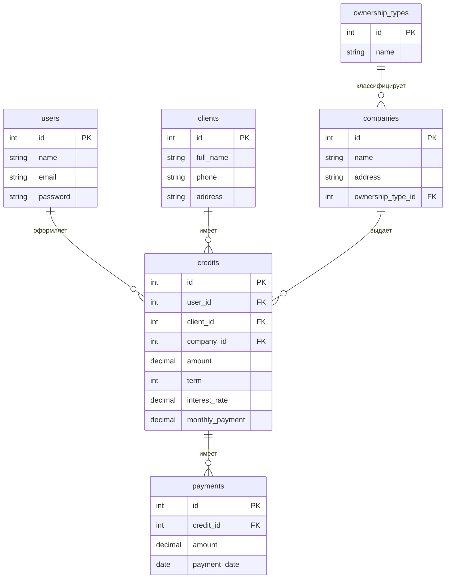

# LoanLaravel - Кредитная информационная система


**Курсовая работа по дисциплине "Базы данных"**  
*Демонстрация проектирования нормализованной реляционной БД и реализации информационной системы*

## Нормализованная структура БД


##  Запуск проекта

```bash
# 1. Клонирование репозитория
git clone https://github.com/your-username/LoanLaravel.git
cd LoanLaravel

# 2. Установка зависимостей PHP
composer install --ignore-platform-reqs

# 3. Установка зависимостей Node.js
npm install

# 4. Настройка окружения
cp .env.example .env
php artisan key:generate

# 5. Редактирование .env файла (настройте под свою БД)
nano .env  # или открыть в любом редакторе

# 6. Создание базы данных (если не создана)
mysql -u root -p -e "CREATE DATABASE laravel_credit;"

# 7. Запуск миграций с тестовыми данными
php artisan migrate --seed

# 8. Сборка фронтенда (в development режиме)
npm run dev

# 9. Запуск сервера (в отдельном терминале)
php artisan serve

# 10. Доступ к приложению
http://localhost:8000
```
